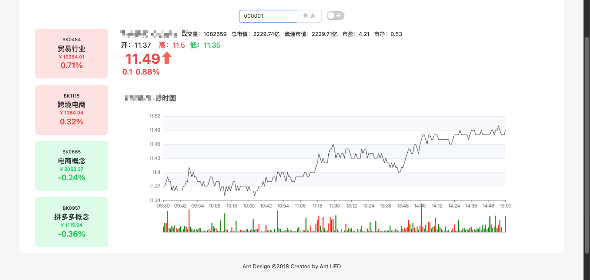

# stock

vue echart

功能：

- 实时股票分析 
- 分时图
-  k线图 （待开发）
- 量能图
- 板块信息

注：项目尚未完善，仅供学习参考

## 项目启动

### 第一步

复制项目

```git
git clone git@github.com:peng0928/stock.git
```

### 第二步

启动后端项目：python3.7+ fastapi

```python
cd starApi
pip install -r requirements.txt -i https://pypi.tuna.tsinghua.edu.cn/simple
python main.py
```


启动前端项目：vue3 echart antd

```yarn
cd stock/stock
yarn install 
yarn dev
```


## 项目截图

